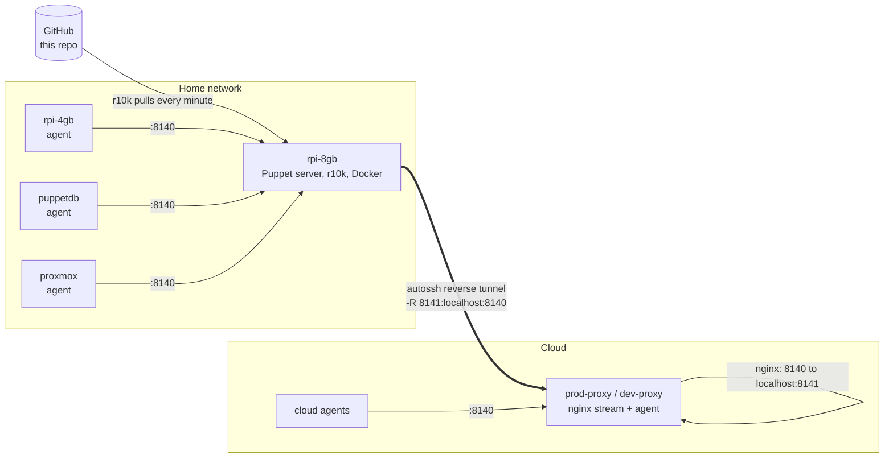

```
   __    __   ______   __       __  ________  __         ______   _______  
  |  \  |  \ /      \ |  \     /  \|        \|  \       /      \ |       \ 
  | $$  | $$|  $$$$$$\| $$\   /  $$| $$$$$$$$| $$      |  $$$$$$\| $$$$$$$\
  | $$__| $$| $$  | $$| $$$\ /  $$$| $$__    | $$      | $$__| $$| $$__/ $$
  | $$    $$| $$  | $$| $$$$\  $$$$| $$  \   | $$      | $$    $$| $$    $$
  | $$$$$$$$| $$  | $$| $$\$$ $$ $$| $$$$$   | $$      | $$$$$$$$| $$$$$$$\
  | $$  | $$| $$__/ $$| $$ \$$$| $$| $$_____ | $$_____ | $$  | $$| $$__/ $$
  | $$  | $$ \$$    $$| $$  \$ | $$| $$     \| $$     \| $$  | $$| $$    $$
   \$$   \$$  \$$$$$$  \$$      \$$ \$$$$$$$$ \$$$$$$$$ \$$   \$$ \$$$$$$$ 
```

# puppet-homelab

A Puppet control repository that manages a small homelab as code: Raspberry Pis at home, a
Proxmox host, PuppetDB, and cloud VMs that live outside the home network.

## The problem it solves

A homelab grows one SSH session at a time. Every box ends up with a slightly different shell,
user list, SSH config and package set, and nobody remembers how the last one was built.

This repo makes the build repeatable:

- **One baseline for every machine.** Users, SSH hardening, sudo, unattended upgrades, a
  standard toolset and a shell setup are declared once and applied everywhere.
- **Git is the source of truth.** A push to a branch becomes a Puppet environment within a
  minute, so changes are reviewed, versioned and reversible.
- **Secrets stay encrypted in the repo.** Passwords and keys are stored with hiera-eyaml, so
  the repo can be shared without exposing them.
- **No inbound ports at home.** The Puppet server sits behind a home router (and possibly
  CGNAT). Cloud nodes still reach it through reverse SSH tunnels and small nginx stream
  proxies, using the [puppet-autossh](https://github.com/ethan-c-houghton/puppet-autossh)
  module. The same path also carries Wazuh agent traffic.

## Architecture



How a cloud agent reaches the Puppet server:

1. The Puppet server opens an outbound SSH connection to the proxy with autossh and publishes
   its own port 8140 as port 8141 on the proxy (`-R 8141:localhost:8140`).
2. nginx on the proxy listens on 8140 and forwards TCP to `localhost:8141`, straight into the
   tunnel.
3. Cloud agents talk to `proxy:8140` as if it were the Puppet server. The proxy node itself
   points its agent at `serverport = 8141` and maps `puppetserver` to `127.0.0.1`.

Nothing at home accepts inbound connections. If the tunnel drops, autossh re-establishes it.
The same pattern forwards Wazuh ports 1514, 1515 and 55000 to a Wazuh manager at home.

## How it works

### Environments (r10k)

`r10k` on the Puppet server deploys every Git branch as a Puppet environment, prefixed with
the source name:

| Branch | Environment |
|---|---|
| `production` | `puppet_homelab_production` |
| `development` | `puppet_homelab_development` |

This public copy only has `main`. Create `production` and `development` branches in your copy.

A cron job runs `r10k deploy environment -p` every minute, so a push is live on the next
agent run (agents run every 5 minutes). A node picks its environment in its Hiera data
(`puppet_agent::config`), which lets one machine test the `development` branch while the
rest stay on `production`.

`Puppetfile` lists the modules r10k installs: Forge modules (accounts, ssh, sudo, nginx,
docker, zabbix, wazuh, puppetdb and others) plus two git modules, `default_packages` and
[`autossh`](https://github.com/ethan-c-houghton/puppet-autossh).

### Classification (`manifests/site.pp`)

Roles are built from profiles:

| Profile | What it applies |
|---|---|
| `profile::base` | `default_packages`, `puppet_agent`, `cron`, `accounts`, `sudo`, `ssh`, `unattended_upgrades`, `ohmyzsh` |
| `profile::raspberry_pi` | Removes the dphys swap file to spare the SD card |

Node blocks then combine profiles with node-specific classes:

| Node | Classes |
|---|---|
| `rpi-8gb` (Puppet server) | base, raspberry_pi, `autossh`, `r10k`, `hiera`, `docker`; maps `puppetserver` to `127.0.0.1` |
| `rpi-4gb` | base, raspberry_pi |
| `prod-proxy`, `dev-proxy` | base, `nginx` (stream proxies from Hiera) |
| anything else (`default`) | base |

### Data (Hiera)

`hiera.yaml` looks up data in this order, first match wins (hashes merge deep where
`lookup_options` says so):

1. `data/nodes/<certname>.yaml`: per-node settings (proxies, tunnels, containers, themes).
2. `data/os/<os family>.yaml`: per-OS tweaks.
3. `data/common.yaml`: the baseline for every node.
4. `data/secrets/<certname>.eyaml`, then `data/secrets/common.eyaml`: encrypted values,
   decrypted on the server with the PKCS7 keys in `/etc/puppetlabs/puppet/keys/`.

What `common.yaml` gives every machine:

- An admin user with zsh and sudo, logging in by SSH key only. `root` and the cloud image's
  default `ubuntu` user are locked.
- `PasswordAuthentication no` in sshd.
- oh-my-zsh with themes and plugins (syntax highlighting, autosuggestions) for admin and root.
- A standard toolset: `tmux`, `htop`, `nmap`, `tcpdump`, `dnsutils`, `ncdu`, `traceroute`
  and friends.
- Agent settings: 5-minute run interval, server name.

Per-node examples:

- `rpi-8gb`: r10k and eyaml setup, the r10k cron job, Zabbix agent 2 settings, n8n in Docker,
  and the autossh tunnels to the prod proxy.
- `prod-proxy` / `dev-proxy`: an `autossh` login user holding the server's tunnel key, and the
  nginx stream proxies (Puppet on 8140, Wazuh on 1514, 1515 and 55000).

### Custom functions (`lib/puppet/functions`)

| Function | Purpose |
|---|---|
| `string_to_port(name, start, end)` | Hashes a string to a stable port in a range. autossh uses it to give each tunnel its own monitor port without a lookup table. |
| `get_source_path(module, file)` | Builds a `puppet:///modules/...` URL. |

## Getting started

This is a sanitized copy, so it will not run until the placeholders are replaced:

| Placeholder | Replace with |
|---|---|
| `homelab.example` | Your domain (node certnames and file names use it) |
| `YOUR_GITHUB_USER` | Where your copy of this repo and the `default_packages` module live |
| `REPLACE_WITH_SHA512_CRYPT_HASH` | Output of `mkpasswd -m sha-512` |
| `AAAA_REPLACE_WITH_...` | Your SSH public keys |
| `ENC[PKCS7,REPLACE_WITH_EYAML_ENCRYPTED_VALUE]` | `eyaml encrypt -s '<value>'` with your own keys |

`default_packages` is a private module that is not published. A few lines of Puppet that
install the `default_packages` Hiera array do the same job.

Then, roughly (full commands in [Installations.md](Installations.md)):

1. **Puppet server** (Debian 12, arm64 works): install `puppetserver`, `puppet-agent`, `r10k`
   and Java 17, add a deploy key for this repo, write `/etc/puppetlabs/r10k/r10k.yaml`
   pointing at it, and run `r10k deploy environment -pv`. After that, the server manages its
   own r10k, Hiera and cron through this repo.
2. **Home agents**: install `puppet-agent`, set `server` and `environment` in `puppet.conf`,
   run `puppet agent -t`, and sign the certificate on the server.
3. **Cloud proxy**: create the `autossh` user's authorized key from the server's generated
   key, install the agent with `serverport = 8141`, and map `puppetserver` to `127.0.0.1`.
4. Add a `node` block in `site.pp` and a file in `data/nodes/` for each new machine.

## Current state

This is a working homelab, not a finished product:

- Zabbix, PuppetDB and Proxmox settings are partly commented out or empty while they are
  being reworked.
- Forge modules in the `Puppetfile` are unpinned, so r10k installs the latest release of
  each. Pin versions before relying on this for anything important. The `autossh` module is
  pinned to a release tag.
- The tunnels do not pin the proxy's SSH host key yet (they trust it on first use). Add a
  `host_key` to each tunnel in `data/nodes/rpi-8gb.homelab.example.yaml`; see the
  [puppet-autossh README](https://github.com/ethan-c-houghton/puppet-autossh#host-key-checking).
